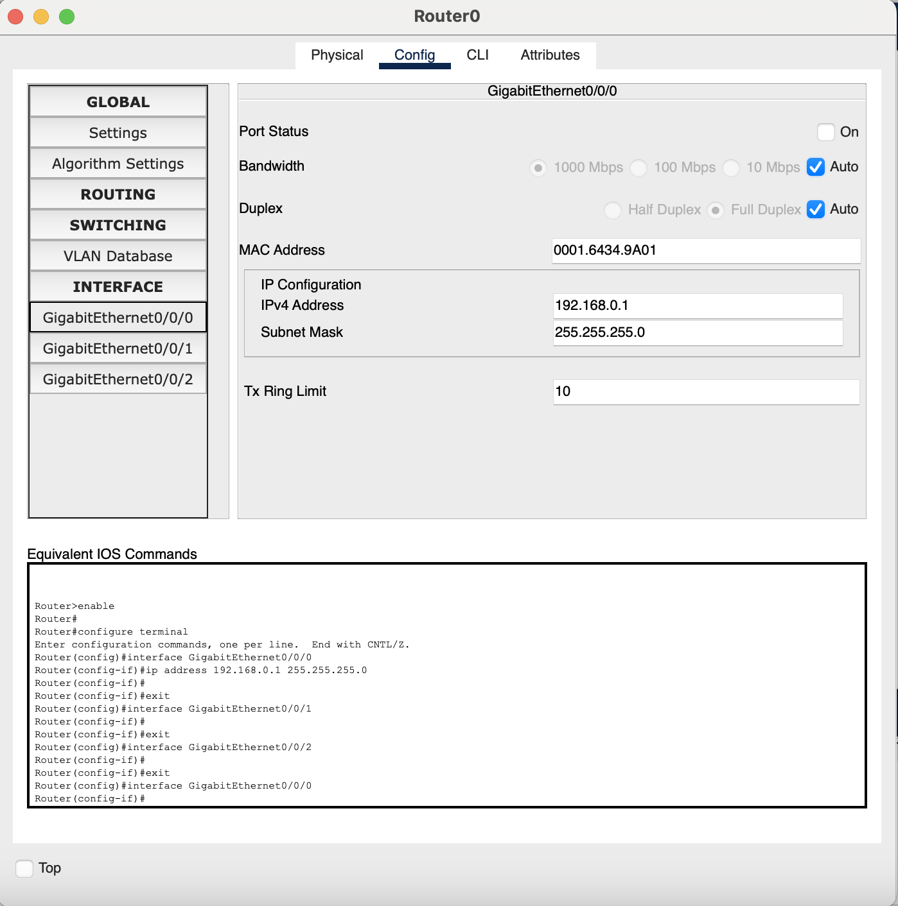
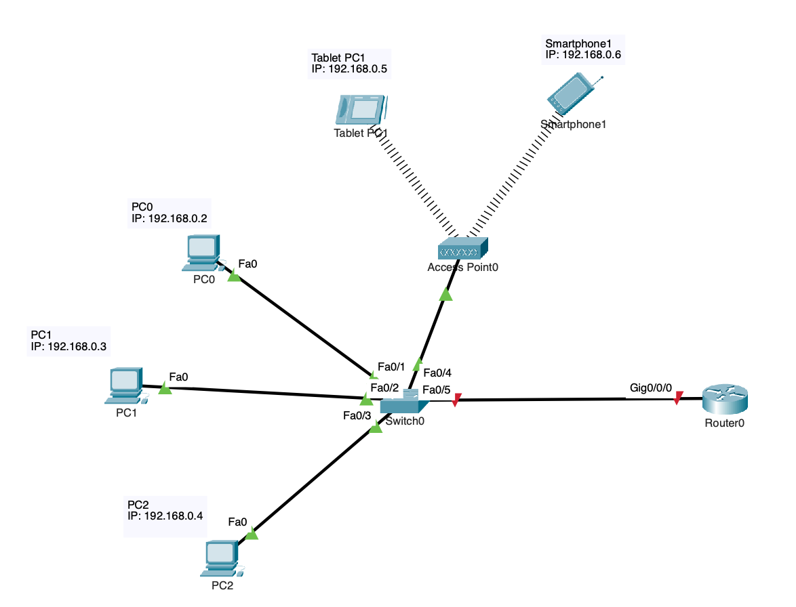
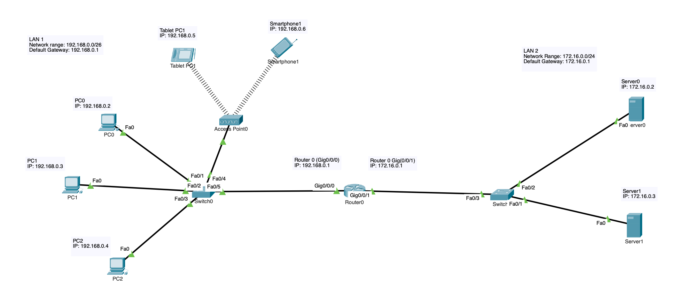

# Mini-Project-01---Network-Setup-and-Troubleshooting

# Step-by-Step Configuration Guide
**Objective**

**Use Cases**

One use case would be at LMU. LMU has multiple local area networks spanning across multiple buildings and they ultimately connect to the main servers in University hall. All of this would not be connected if it wasn't for established connections of networks. While the scale of LMU's network is much larger than what we can replicate in classes, the overall foundation of the architecture is similar to what we can replicate in packet tracer and class. 

Another use case could be tech giants such as Google. Google has offices and data centers all around the world. This is connected through networks on a larger scale. 

**Choose software and hardware**
  
  Decide what the objective is. In this case, it would be to create a network between multiple LANs and establish communciation between various devices. Thus, we would require switches, routers, end devices, ethernet cables, etc. 

**IP assignments**
  
  IPs are essential in identifying each device as well as allowing them to communicate with other devices. However, one of the most common issues with assigning IPs is IP address conflicts where two or more devices have the same IP. To prevent this, it would be most efficient to assign IPs beforehand to minimize confusion and human error. For this project, networks 192.168.0.0/26 and 172.16.0.0/24 have been assigned. 
  
Device  | IP  | Default Gatway | Subnet Mask
------------- | ------------- | -------------- | ------------
Router 0 (Gig0/0)  | 192.168.0.1  | 
PC0  | 192.168.0.2  |  192.168.0.1 |  255.255.255.192
PC1  | 192.168.0.3  |  192.168.0.1 |  255.255.255.192 
Router 0 (Gig0/1)  | 172.16.0.1  |  
PC2  | 172.16.0.2  |  172.16.0.1 |  255.255.255.0
PC3 | 172.16.0.3  |  172.16.0.1 |  255.255.255.0 

**Add end devices (PCs/laptops/printers/tablets/etc)**
  
  Once an end device (Laptop, PC, etc) has been added, as seen in the image, you would then manually assign the IP address. On a Mac, you would go to system settings -> network -> details -> TCP/IP -> set configure IPv4 to "Manual" -> enter IP address and subnet mask as listed in the table above. 
    You would also need to assign the default gateway to establish communication between the end device and the eventual addition of a router. Otherwise, the end device would not be able to recognize which channel to communicate through once a network has been established among multiuple LANs. To do this, change "router" to the assigned value as listed int he above table. 

**Add switch**

  You then connect the end devices to the switch using the ethernet cables. It will take a little bit of time for the switch to boot and connect to the end devices. The switch must be connected to a power outlet in order for it to turn on. The switches we have been using does not have a on-off button so it should automatically turn on once plugged in. A switch connects various devices on a network, allowing them to communicate with each other and share resources. In this case, without the switch, PC 0 would not be able to communicate with PC 1. 

**Add a router to talk to different networks**

  A router helps connect devices to the internet and connect the devices to each other. In this project, the router allows devices from one LAN to communicate with devices from another LAN. The router must also be connected to a power outlet and, contrary to the switch, it should have an on-off switch so make sure to turn the router on. It will take a moment for the router to boot up as well. Once the router is turned on, you must first connect an ethernet cable to the port labeled "console" to configure the IP address on the router. 

**Configure IPs on router**

  Firstly, IPs have to be configured on the router because we want to identify the router within a network. Moreover, as the router, in this case, will be the default gateway, each gigabit port has to be configured so that the end devices know the pathway it has to take to reach another device. To configure the IP on the router, you must first access the Cisco CLI. As shown in the image, you must first install driver for a serial adapter. Then, you open terminal on the mac and type "ls /dev/*usb*". After that, type "screen /dev/USB-SERIAL-CONNECTION BAUD-RATE" then press enter twice. This should allow you to enter the Cisco CLI. 

  

  Once the IP address for the router itself has been configrued, the IP address for each specific LAN port on the router must also be configured. 
  Once the port has been configured, connect the switch to the router using an ethernet cable. Make sure to connect the ethernet cable to the correct port as assigned earlier. 
  I have configured the IP on the router. However, it is still not communicating with the switch. 

**Connect the switches to the router with ethernet cables**

  It will take a moment for the router to boot up as well. Once the router is turned on, you must first connect a ethernet cable to the port labeled "console" to configure the IP address on the router. 

**LAN Added**

  I have now added another LAN using the same exact steps as before, however, using different network ranges. I have added a new switch and two servers. 

**Set default gateway to all end devices**

  As done in the "Add end devices" step, I have configured all the default gateways on the network. However, we have to be careful of which router port used in order to configure default gateways. 

# FAQ 

1. What do I do to check if my devices are successfully connected to a LAN?
   Try to ping the other device using "terminal" if operating on a mac. On terminal, type "ping [IP address]" and if you get a response detailing ping, your device is successfully connected to the LAN. If the ping times out, check to see if the ethernet cables are securely connected to the switch and devices. If those are connected as well, check to see if the IP and subnet mask are configured properly on each device. There may be a typo error with the numbers or you may have made an error with the subnet mask. By configuring these correctly and ensuring the ethernet cables are connected, the devices should be able to communicate with each other.

2. I can't connect my devices across different LANs. What do I do?
   First, check to make sure the router is turned on. There should an on-off switch. If that's not the issue, make sure the ethernet cables are connected to the right gigabit ports. When configuring the router, you should have configured a specific port with a specific default gateway IP. You may also want to carefully check the IP values again to see if there are no typos. You also want to check if the default gateway is assigned on each of your end devices. Finally, if that is not the case make sure all the cables are securely connected with no loose ends and if this is not the issue you may have to reconfigure the router.

3. Making IP assignments more clear and concise
   As I have done so in the step-by-step configuration guide, it is good practice to make a table of all the devices in a network and assigning the IP/subnet masks beforehand. By doing this, it eradicated human error as well as being able to identify the IPs of each specific device easily. Further, a common mistake occurs when one forgets to leave the first IP address open for the default gateway. By creating a table, you are able to account for this beforehand and eradicate this mistake.

4. Setting-up / maintaining networks
   One good practice for setting-up / maintaining a network is to always have the main objective/idea before setting up the hardware. This is because various hardware and cables can get messy and inefficient without having a clear idea fo what you are trying to do. One of the ways we have done this is through creating the network in packet tracer beforehand. By making the network virtually, you are able to clearly visualize what needs to be connected to what and the actions needed to be taken to complete the network.

5. Modifying hardware
   One safety hazard to not is that unlike virtual networks on packet tracer, physical hardware has electricity running through them with high energy output at times due to the various devices connected to them. Thus, when disconnecting wires or cables from devices such as switches or cables, ensure that they are turned off. This way, it minimizes any hazards.

6. Firewall/security settings
   On mac it usually isn't an issue but with other operating systems, there are occasions where a website won't open due to firewall settings. For example, once different LANs have been connected, you may try to open a website from another device. However, with a firewall, this may be blocked, Thus, ensure that firewalls are blocked if you have any issues with opening up websites across devices.

7. Slow speeds
   Slow connectivity issues can be attributed to various factors such as outdated hardware, network traffic, bandwidth limitations, and many more. One issue which is encountered frequently is network traffic in which too many devices are trying to connect at once increasing traffic. One way to handle this is by simply decreasing the number of devices trying to connect to a network. Another solution is to increase the hardware so that the network capacity increases.

# Retrospective 

