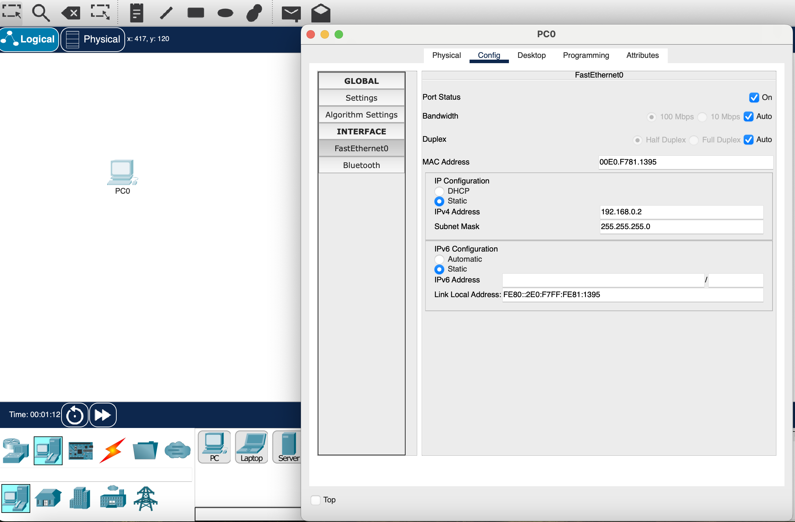
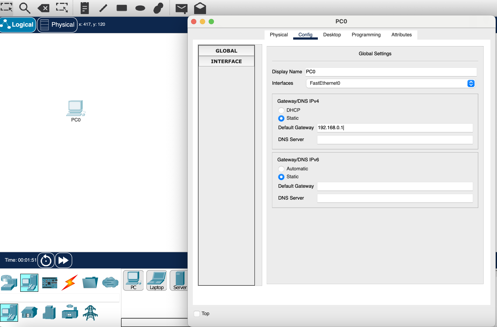
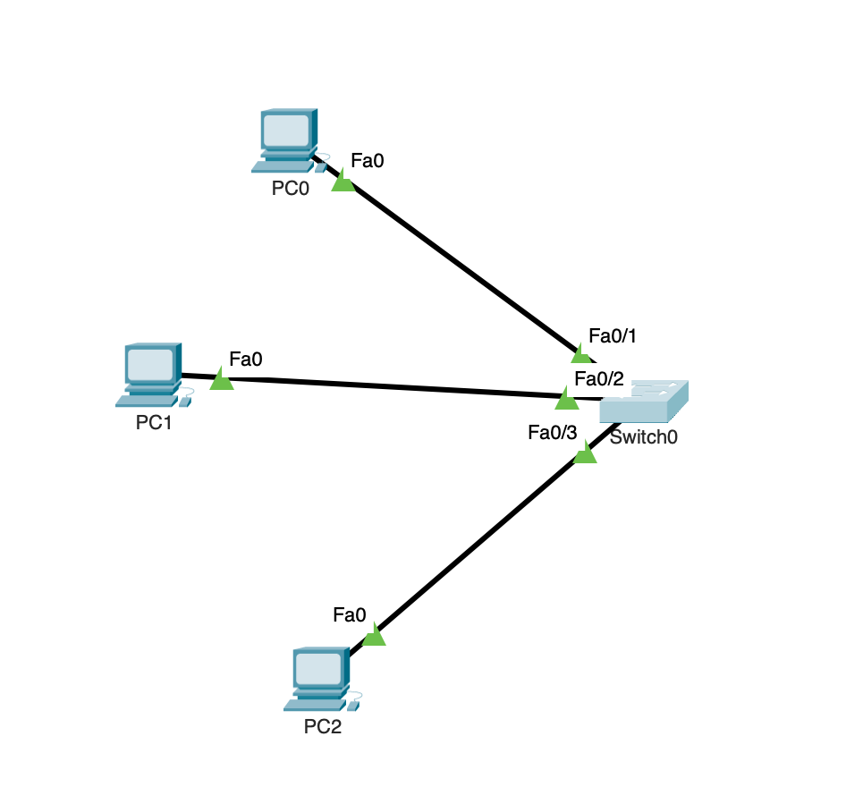
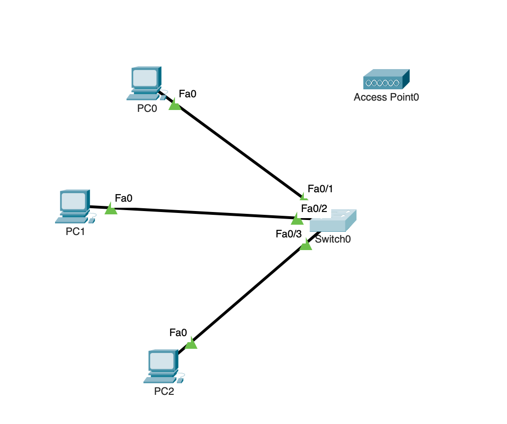
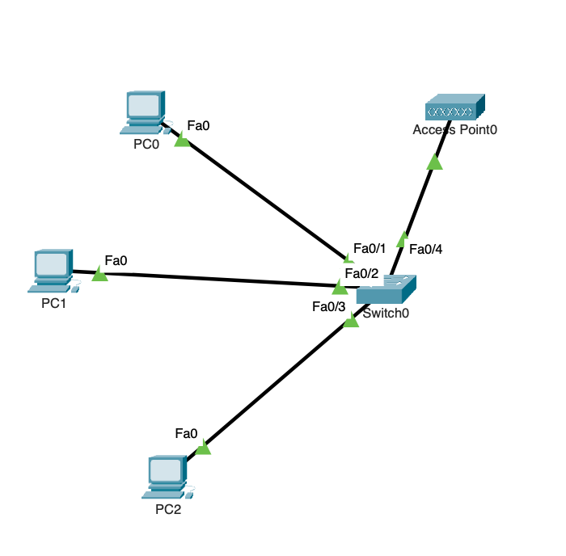
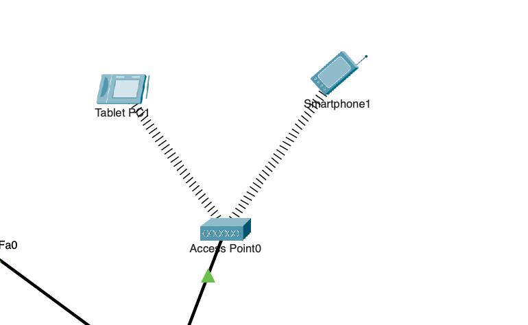
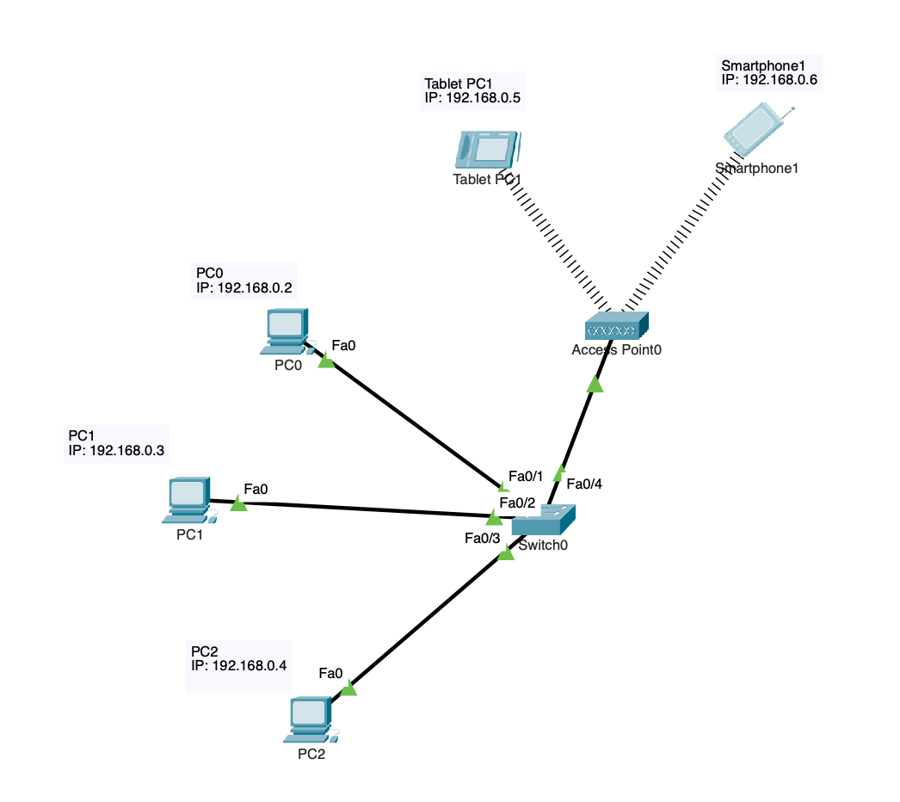
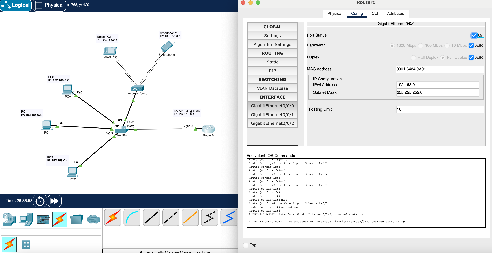

# Mini-Project-01---Network-Setup-and-Troubleshooting

**Objective**

**Use Cases**

One use case would be at LMU. LMU has multiple local area networks spanning across multiple buildings and they ultimately connect to the main servers in University hall. All of this would not be connected if it wasn't for established connections of networks. While the scale of LMU's network is much larger than what we can replicate in classes, the overall foundation of the architecture is similar to what we can replicate in packet tracer and class. 

Another use case could be tech giants such as Google. Google has offices and data centers all around the world. This is connected through networks on a larger scale. 

**Choose software and hardware**
  
  Decide what the objective is. In this case, it would be to create a network between multiple LANs. Thus, we would require switches, routers, end devices, WAP, ethernet cables, servers, etc. 

**IP assignments**
  
  It would be most efficient to assign IPs beforehand to minimize confusion and human error. For this project, network ranges 192.168.0.0/26 and 172.16.0.0/24 have been assigned. 
Device  | IP  | Default Gatway 
------------- | ------------- | --------------
Router 0 (Gig0/0)  | 192.168.0.1  | 
PC0  | 192.168.0.2  |  192.168.0.1 
PC1  | 192.168.0.3  |  192.168.0.1 
PC2  | 192.168.0.4  |  192.168.0.1 
Tablet PC1  | 192.168.0.5  |  192.168.0.1 
Smartphone  | 192.168.0.6  |  192.168.0.1 
Router 0 (Gig0/1)  | 172.16.0.1  |  
Server 0  | 172.16.0.2  |  172.16.0.1 
Server 1  | 172.16.0.3  |  172.16.0.1 

**Add end devices (PCs/laptops/printers/tablets/etc)**
  
  Once an end device has been added, as seen in the image, you would then assign the IP address. The subnet mask will automatically be assigned in packet tracer after assigning an IP. 

  You would also need to assign the default gateway to establish communication between the end device and the router. Otherwise, the end device would not be able to recognize which channel to communicate through once a network has been established among multiuple LANs. 

**Add switch**

  As seen in the image below, you then connect the end devices to the switch using the ethernet cables. It will take a little bit of time for the switch to boot and connect to the end devices. The green triangles in packet tracer indicated successful communication between the switch and the end device. 

**Add WAP**

  As shown in the image, a WAP has been added. However, without ethernet cables it is not connected to the switch, which means it isn't connected to the network. 

**Connect WAP to a switch**

  Now, using an ethernet cable, the access point is communicating successfully with the switch, as indicated by the green trianlge. 

**Add mobile devices**

  Now, mobile devices have been added. 

**Set IP address on end devices (mobile devices included)**
  
  Similar to what I have done before, I have configured the IP addresses of all end devices. 

**Add a router to talk to different networks**

  A router has been added, however, it is currently disconnected from the network. 

**Connect the switches to the router with ethernet cables**

  The router has been connected to the switch using ethernet cables. However, it still has a red mark, indicating unsuccessful communication. 

**Configure IPs on router**

  I have configured the IP on the router. However, it is still not communicating with the switch. 

**Set Port Status to ON on router**

  Now, with the port status turned on on router, the router is successfully communicating with the switch. One way I could check if it's actually successful is by pinging the router from any end device. 

**LAN Added**

  I have now added another LAN using the same exact steps as before, however, using different network ranges. I have added a new switch and two servers. 

**Set default gateway to all end devices**

  As done in the "Add end devices" step, I have configured all the default gateways on the network. However, we have to be careful of which router port used in order to configure default gateways. 

